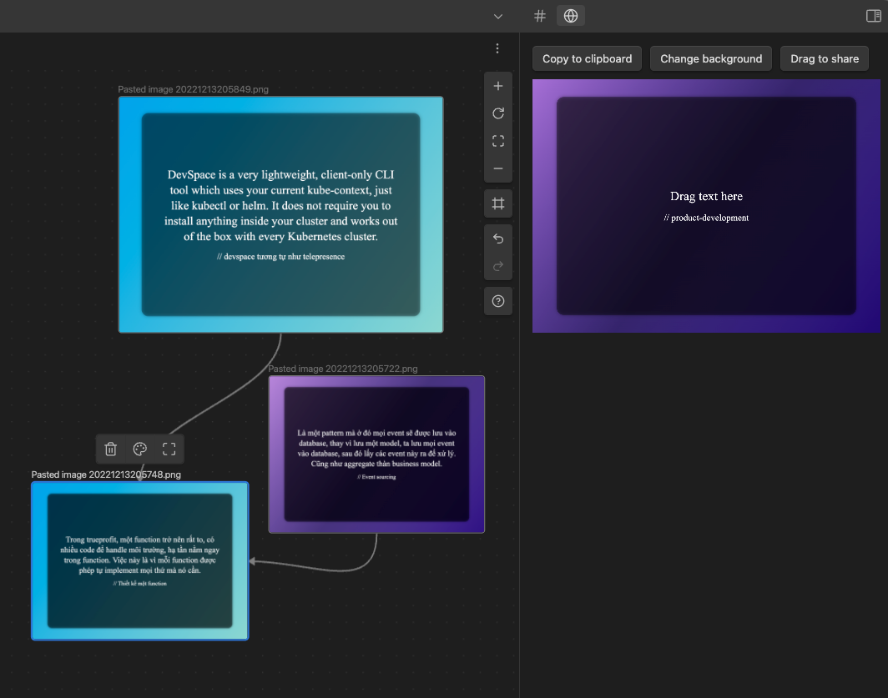

# Obsidian Share

This plugin allows you to embed any website in your Obsidian.

## Features

-   Generate gradient image for your text

## Usage

1. Drop text to the gradient
1. click "Copy to clipboard"
1. Paste it to your note or Twitter
